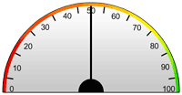

# python-gauge

[andrewshay.me Blog Post - How to create a gauge / speedometer graphic with Python](https://andrewshay.me/blog/how-to-create-a-gauge-speedometer-graphic-with-python/)  
Create a gauge graphic with Python.  
Images files (including psd) licensed under [Attribution 4.0 International (CC BY 4.0)](https://creativecommons.org/licenses/by/4.0/)

# Setup

`Python 3.6`  
`pip install -r requirements`

# Screenshot

